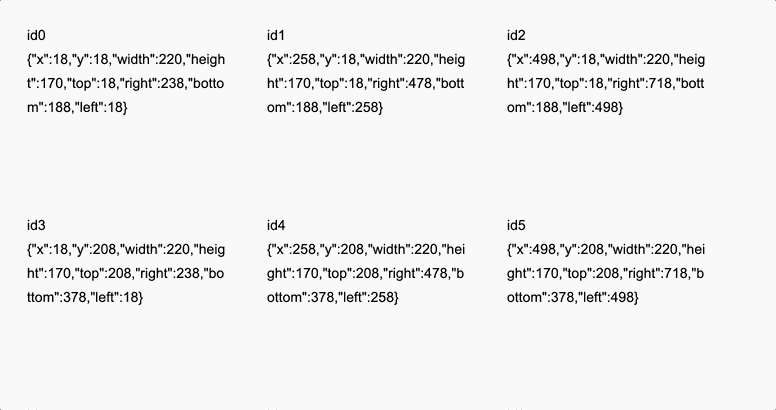

# useMultipleRects

A React hook that retrieves the window position and dimensions of multiple elements by unique IDs.



## Usage

```javascript
import { useMultipleRects } from 'use-multiple-rects';

const example = () => {
  const ids = ['id1', 'id2', 'id3'];

  const [refs, rects] = useMultipleRects({ ids });

  return (
    <>
      <div ref={refs['id1']}>Dimensions: {JSON.stringify(rects['id1'])}</div>
      <div ref={refs['id2']}>Dimensions: {JSON.stringify(rects['id2'])}</div>
      <div ref={refs['id3']}>Dimensions: {JSON.stringify(rects['id3'])}</div>
    </>
  );
};
```

## License

MIT
